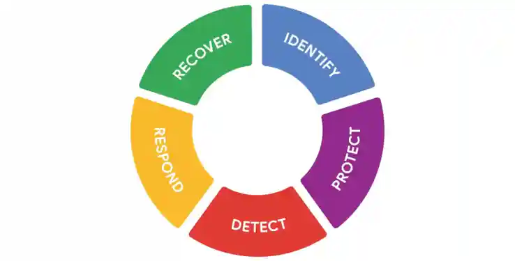

# Directrices de seguridad en acción
#ciberseguridad #curso-5 #modulo-1 

---
Las organizaciones se enfrentan a menudo a una cantidad abrumadora de Riesgos. Desarrollar un plan de Seguridad desde el principio que aborde todos los riesgos puede ser todo un reto. Esto hace que los marcos de seguridad sean una opción útil.

En esta lectura, explorará cómo puede implementarse el NIST CSF.

## Orígenes del framework

Originalmente publicado en 2014, el NIST desarrolló el marco de ciberseguridad para proteger las infraestructuras críticas de Estados Unidos. El NIST fue seleccionado para desarrollar el CSF porque son una fuente imparcial de datos y prácticas científicas. Con el tiempo, el NIST adaptó el CSF para ajustarlo a las necesidades de las empresas de los sectores público y privado. Su objetivo era flexibilizar el framework, facilitando su adopción por parte de las pequeñas empresas o de cualquier otra persona que pudiera carecer de los recursos necesarios para desarrollar sus propios planes de Seguridad.
## Componentes del MCA

Como recordará, el framework consta de tres componentes principales: el _núcleo_, _los niveles_ y los _perfiles_. En las siguientes secciones, aprenderá más sobre cada uno de estos componentes del CSF.
### Núcleo

El núcleo del CSF es un conjunto de resultados de ciberseguridad deseados que ayudan a las organizaciones a personalizar su plan de seguridad. Consta de cinco funciones, o partes: Identificar, Proteger, Detectar, Responder y Recuperar. Estas funciones se utilizan habitualmente como referencia informativa para ayudar a las organizaciones a _Identificar_ sus recursos más importantes y _Proteger_ dichos recursos con las salvaguardas adecuadas. El núcleo del CSF también se utiliza para comprender las formas de _detectar_ ataques y desarrollar planes de _respuesta_ y _recuperación_ en caso de que se produzca un ataque.
### Niveles

Los niveles del CSF son una forma de medir la sofisticación del programa de ciberseguridad de una organización. Los niveles del CSF se miden en una escala de 1 a 4. El nivel 1 es la puntuación más baja, lo que indica que se ha implementado un conjunto limitado de controles de Seguridad. En general, los niveles del CSF se utilizan para evaluar la postura de Seguridad de una organización e identificar áreas de mejora.
### Perfiles

Los perfiles del CSF son plantillas prefabricadas del NIST CSF desarrolladas por un Equipo de expertos del sector. Los perfiles de los CSF se adaptan para abordar los riesgos específicos de una organización o industria. Se utilizan para ayudar a las organizaciones a desarrollar una línea de base para sus planes de ciberseguridad, o como una forma de comparar su postura actual de ciberseguridad con un estándar específico de la industria.

**Nota:** El núcleo, los niveles y los perfiles se diseñaron para ayudar a cualquier empresa a mejorar sus operaciones de Seguridad. Aunque sólo hay tres componentes, todo el framework consiste en un complejo sistema de subcategorías y procesos.