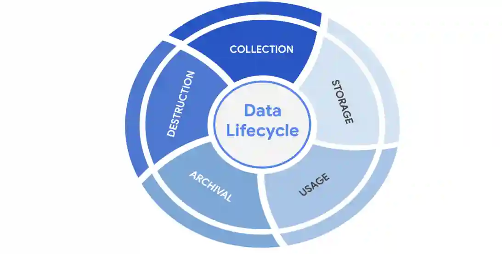

# Ciclo de vida de los datos
#ciberseguridad #curso-5 #modulo-2 

---
En materia de Seguridad, las vulnerabilidades de los datos se suelen representar en un Modelo conocido como Ciclo de vida de los datos. ==Cada etapa del Ciclo de vida de los datos desempeña un papel importante en los Controles de seguridad que se establecen para mantener la tríada CID de la información==. 
## El ciclo de vida de los datos
El ciclo de vida de los datos es un modelo importante que los equipos de seguridad tienen en cuenta a la hora de proteger la información. Influye en la forma en que establecen políticas que se alinean con los objetivos empresariales. También desempeña una función importante en las tecnologías que utilizan los Equipos de Seguridad para hacer accesible la información.

En general, el Ciclo de vida de los datos consta de cinco etapas. Cada una de ellas describe cómo fluyen los datos por una organización desde el momento en que se crean hasta que dejan de ser útiles:

- Recopilar
- Almacenar
- Utilizar
- Archivar
- Destruir

## Gobierno de datos
_El Gobierno de datos_ es un ==conjunto de procesos que definen cómo gestiona la información una organización==. El Gobierno suele incluir políticas que especifican cómo mantener los datos privados, precisos, disponibles y seguros a lo largo de su ciclo de vida.

El Gobierno de datos eficaz es una actividad de colaboración que depende de las personas. Las políticas de Gobierno de datos suelen categorizar a los individuos en un papel específico:

- **Propietario de los datos:** la persona que decide quién puede acceder, editar, utilizar o destruir su Información.
- **Custodio de datos:** cualquier persona o entidad responsable de la manipulación, el transporte y el almacenamiento seguros de la Información.
- **Administrador de datos:** la persona o grupo que mantiene e implementa las políticas de gobierno de datos establecidas por una organización.
## Información protegida legalmente
Los gobiernos y otros organismos reguladores han colmado esta laguna creando normas que especifican los tipos de información que las organizaciones deben proteger por defecto:

- **PII** es cualquier información utilizada para inferir la identidad de un individuo. La información de identificación personal, o PII, se refiere a la información que puede utilizarse para contactar o localizar a alguien.
- **PHI** son las siglas en inglés de información sanitaria protegida. En EE.UU., está regulada por la Ley de Transferencia y Responsabilidad de los Seguros Médicos (HIPAA), que define la PHI como "información relacionada con la salud o el estado físico o mental pasado, presente o futuro de una persona" En la UE, la PHI tiene una definición similar, pero está regulada por el Reglamento General de Protección de Datos (GDPR).
- La **SPII** es un tipo específico de PII que se rige por unas directrices de tratamiento más estrictas. La _S_ significa sensible, lo que significa que se trata de un tipo de información de identificación personal a la que sólo debe accederse en la medida en que sea necesario, como el número de una cuenta bancaria o las credenciales de inicio de sesión.