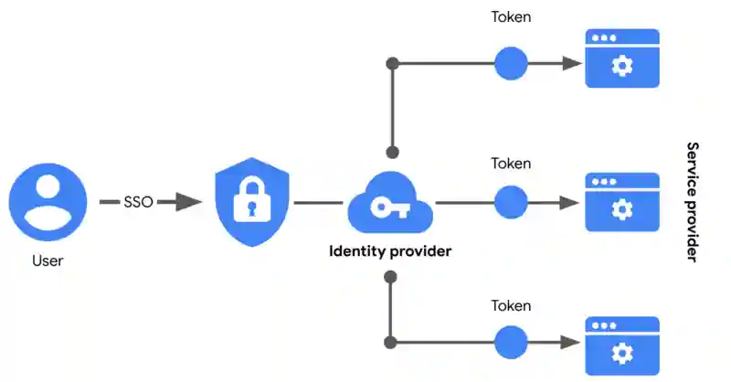
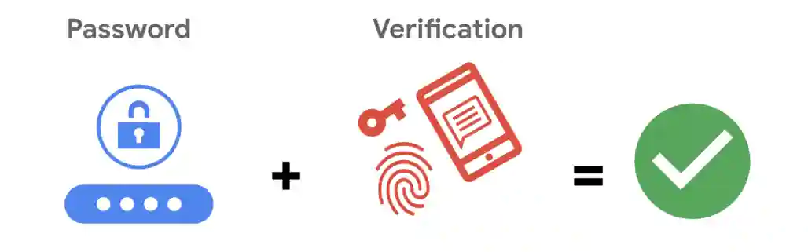

# El auge de SSO y MFA
#ciberseguridad #curso-5 #modulo-2 

---
## Un mejor enfoque de la autenticación

El **inicio de sesión único (SSO)** es una tecnología que combina varios inicios de sesión diferentes en uno solo. Cada vez más empresas recurren al SSO como solución a sus necesidades de autenticación por tres razones:

1. El SSO **mejora la experiencia del usuario** al eliminar el número de nombres de usuario y contraseñas que la gente tiene que recordar.

2. **Las empresas pueden reducir costes** racionalizando la forma en que gestionan los servicios conectados.

3. El **SSO mejora la Seguridad general** al reducir el número de puntos de acceso a los que pueden dirigirse los atacantes.

Esta tecnología empezó a estar disponible a mediados de la década de 1990 como una forma de combatir la ==**fatiga de contraseñas**, que se refiere a la tendencia de la gente a reutilizar contraseñas en todos los servicios==. Recordar muchas contraseñas diferentes puede ser un reto, pero utilizar la misma contraseña repetidamente supone un importante riesgo para la Seguridad. El SSO resuelve este dilema desplazando la carga de la autenticación lejos del usuario.
## Cómo funciona el SSO

El SSO funciona automatizando el modo en que se establece la confianza entre un usuario y un proveedor de servicios. En lugar de hacer recaer la responsabilidad en un empleado o cliente, las soluciones SSO recurren a terceros de confianza para demostrar que un usuario es quien dice ser. Esto se hace mediante el ==intercambio de tokens de acceso encriptados entre el proveedor de identidad y el proveedor de servicios==.

Al igual que otros tipos de información digital, estos tokens de acceso se intercambian utilizando protocolos específicos. Las implementaciones de SSO suelen basarse en dos protocolos de autenticación diferentes: LDAP y SAML. LDAP, que significa **Protocolo ligero de acceso a directorios**, se utiliza sobre todo para transmitir información dentro de las instalaciones; SAML, que significa **Lenguaje de marcado de aserción de seguridad**, se utiliza sobre todo para transmitir información fuera de las instalaciones, como en la nube.

## Limitaciones del SSO

Los nombres de usuario y las contraseñas por sí solos no siempre son la forma más segura de proteger la información confidencial. El SSO proporciona beneficios útiles, pero sigue existiendo el riesgo asociado al uso de una sola forma de autenticación. Por ejemplo, una contraseña perdida o robada podría exponer información a través de múltiples servicios. Afortunadamente, existe una solución a este problema.
## MFA al rescate

La **autenticación de múltiples factores** (MFA) requiere que un usuario verifique su identidad de dos o más formas para acceder a un sistema o red. En cierto sentido, la MFA es similar a utilizar un cajero automático para retirar dinero de su cuenta bancaria. En primer lugar, usted introduce una tarjeta de débito en la máquina como una forma de identificación. Después, introduce su número PIN como segunda forma de identificación. Combinados, ambos pasos, o factores, se utilizan para verificar su identidad antes de autorizarle a acceder a la cuenta.

## Refuerzo de la autenticación

La MFA se basa en los beneficios de la SSO. Funciona haciendo que los usuarios demuestren que son quienes dicen ser. El usuario debe proporcionar dos factores (2FA) o tres factores (3FA) para autenticar su identificación. El proceso MFA pide a los usuarios que proporcionen estas pruebas, como por ejemplo:

- **Algo que un usuario sabe** : normalmente un nombre de usuario y una contraseña

- **Algo que un usuario tiene:** normalmente recibido de un proveedor de servicios, como un código de acceso de un solo uso (OTP) enviado por SMS

- **Algo que un usuario es** : se refiere a las características físicas de un usuario, como sus huellas dactilares o escáneres faciales.

Exigir múltiples formas de identificación es una medida de seguridad eficaz, especialmente en los entornos de nube. Puede ser difícil para las empresas en la Nube asegurarse de que los usuarios que acceden remotamente a sus sistemas no son actores de amenazas. La MFA puede reducir el riesgo de autenticar a los usuarios equivocados exigiendo formas de identificación difíciles de imitar o de someter a fuerza bruta.