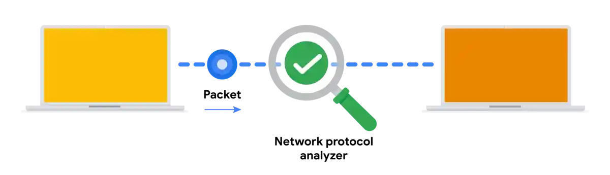

# Más información sobre la captura de paquetes
#ciberseguridad #curso-6 #modulo-2 

---
La función de los analistas de seguridad consiste en supervisar y analizar los flujos de tráfico de la red. Una forma de hacerlo es generando capturas de paquetes y analizando después el tráfico capturado para identificar actividades inusuales en una red.
## Paquetes

Anteriormente en el Programa, aprendió que un **paquete de datos** es una unidad básica de información que viaja de un dispositivo a otro dentro de una red. La Detección de intrusiones en la red comienza en el nivel de los paquetes. Esto se debe a que los paquetes constituyen la base del intercambio de información a través de una red. Por ejemplo, al cargar una imagen en un sitio web, los datos se dividen en varios paquetes, que luego se dirigen al destino previsto y se vuelven a ensamblar en el momento de la entrega.

En ciberseguridad, los paquetes proporcionan información valiosa que ayuda a añadir contexto a los eventos durante las investigaciones. Comprender la transferencia de información a través de los paquetes no sólo le ayudará a desarrollar una estadística de la actividad de la red, sino que también le ayudará a identificar anomalías y a defender mejor las redes de los ataques.

Los paquetes contienen tres componentes: el encabezado, la carga útil y el pie de página. He aquí una descripción de cada uno de estos componentes.
### Encabezado

Los paquetes comienzan con el componente más esencial: el encabezado . Los Paquetes pueden tener varios Encabezados dependiendo de los protocolos utilizados como un Encabezado Ethernet, un Encabezado IP, un Encabezado TCP y más. Las cabeceras proporcionan información que se utiliza para encaminar los paquetes a su destino. Incluyen información sobre las direcciones IP de origen y destino, la longitud de los paquetes, el protocolo, los números de identificación de los paquetes, etc.
### Carga útil

El componente de carga útil sigue directamente a la cabecera y contiene los datos reales que se entregan. Piense en el ejemplo de subir una imagen a una página web; la carga útil de este paquete sería la imagen en sí.
### Pie de página

El pie de página, también conocido como tráiler, se encuentra al final de un paquete. El protocolo Ethernet utiliza los pies de página para proporcionar información de comprobación de errores con el fin de determinar si los datos se han corrompido. Además, es posible que los paquetes de red Ethernet analizados no muestren información de pie de página debido a las configuraciones de red.

**Nota:** La mayoría de los protocolos, como el Protocolo de Internet (IP), _no_ utilizan pies de página.
## Analizadores de protocolos de red

Los **analizadores de protocolos** de red **(packet sniffers)** son herramientas diseñadas para capturar y analizar el tráfico de datos dentro de una red. Algunos ejemplos de analizadores de protocolos de red son tcpdump, Wireshark y TShark.

Más allá de su uso en seguridad como herramienta de investigación utilizada para supervisar redes e identificar actividades sospechosas, los analizadores de protocolos de red pueden utilizarse para recopilar estadísticas de red, como el ancho de banda o la velocidad, y solucionar problemas de rendimiento de la red, como las ralentizaciones.

Los analizadores de protocolos de red también pueden utilizarse con fines maliciosos. Por ejemplo, los actores maliciosos pueden utilizar los analizadores de protocolos de red para capturar paquetes que contengan datos confidenciales, como información de inicio de sesión de cuentas.

He aquí un diagrama de red que ilustra cómo se transmiten los paquetes desde un emisor hasta el receptor. Un analizador de protocolos de red se coloca en medio de las comunicaciones para capturar los paquetes de datos que viajan por el cable.

### **Cómo funcionan los analizadores de protocolos de red**

Los analizadores de protocolos de red utilizan tanto software como hardware para capturar el tráfico de red y mostrarlo para que los analistas de seguridad lo examinen y analicen. He aquí cómo:

1. En primer lugar, los paquetes deben recogerse de la red a través de la **tarjeta de interfaz de red (NIC)**, que es el hardware que conecta las computadoras a una red, como un router. Las NIC reciben y transmiten tráfico de red, pero por defecto sólo escuchan el tráfico de red dirigido a ellas. Para capturar todo el tráfico de red que se envía a través de la red, una NIC debe conmutarse a un modo que tenga acceso a todos los paquetes de datos de red visibles. En las interfaces inalámbricas, esto suele denominarse modo monitor, y en otros sistemas puede llamarse modo promiscuo. Este modo permite al NIC tener acceso a todos los paquetes de datos de red visibles, pero no ayudará a los analistas a acceder a todos los paquetes de una red. Un analizador de protocolos de red debe colocarse en un segmento de red adecuado para acceder a todo el tráfico entre los distintos hosts.

2. El analizador de protocolos de red recoge el tráfico de red en formato binario sin procesar. El formato Binario consiste en 0s y 1s y no es tan fácil de interpretar para los humanos. El analizador de protocolos de red toma el binario y lo convierte para que se muestre en un formato legible para el ser humano, de modo que los analistas puedan leer y comprender la información con facilidad.
### Captura de paquetes

**El sniffing** de paquetes es la práctica de capturar e inspeccionar paquetes de datos a través de una red. Una **captura de paquetes (p-cap)** es un archivo que contiene paquetes de datos interceptados desde una interfaz o red. Las capturas de paquetes pueden verse y analizarse más a fondo utilizando analizadores de protocolos de red. Por ejemplo, puede filtrar las capturas de paquetes para mostrar sólo la información más relevante para su investigación, como los paquetes enviados desde una dirección IP específica.

**Nota**: El uso de analizadores de protocolos de red para interceptar y examinar comunicaciones de redes privadas sin permiso se considera ilegal en muchos lugares.

Los archivos P-cap pueden tener muchos formatos dependiendo de la biblioteca de captura de paquetes que se utilice. Cada formato tiene diferentes usos y las herramientas de red pueden utilizar o soportar formatos específicos de archivos de captura de paquetes por defecto. Debería estar familiarizado con las siguientes bibliotecas y formatos:

1. **Libpcap** es una biblioteca de captura de paquetes diseñada para ser utilizada por sistemas tipo Unix, como Linux y MacOS®. Herramientas como tcpdump utilizan Libpcap como formato de archivo de captura de paquetes por defecto.
    
2. **WinPcap** es una biblioteca de captura de paquetes de código abierto diseñada para dispositivos con sistemas operativos Windows. Se considera un formato de archivo más antiguo y no se utiliza predominantemente.

3. **Npcap** es una biblioteca diseñada por la herramienta de exploración de puertos Nmap que se utiliza habitualmente en los sistemas operativos Windows.

4. **PCAPng** es un formato de archivo moderno que puede capturar paquetes y almacenar datos simultáneamente. Su capacidad para hacer ambas cosas explica la "ng", que significa "próxima generación".

**Consejo profesional:** Analizar su red doméstica puede ser una buena forma de practicar el uso de estas herramientas.