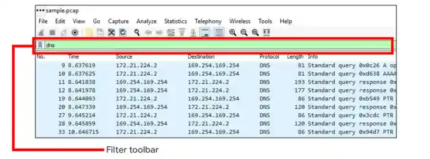
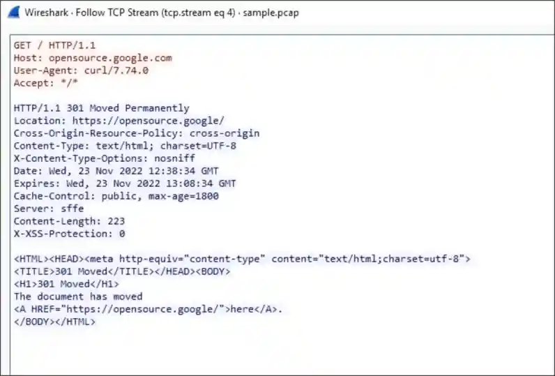

# Investigar los detalles del Paquete
#ciberseguridad #curso-6 #modulo-2 

---
Hasta ahora, ha aprendido cómo los Analizadores de protocolos de red (packet sniffers) interceptan las comunicaciones de red. También ha aprendido cómo puede analizar las capturas de paquetes (p-caps) para obtener una visión de la actividad que tiene lugar en una red. Como analista de seguridad, utilizará sus habilidades de análisis de paquetes para inspeccionar los paquetes de red e identificar actividades sospechosas durante las investigaciones.
## Protocolo de Internet (IP)

Los paquetes constituyen la base del intercambio de datos a través de una red, lo que significa que la detección comienza a nivel de paquete. El **Protocolo de Internet** (IP) incluye un conjunto de estándares utilizados para enrutar y direccionar los paquetes de datos a medida que viajan entre los dispositivos de una red. IP funciona como la base de todas las comunicaciones a través de Internet.

IP garantiza que los paquetes lleguen a su destino. Existen dos versiones de IP que encontrará en uso hoy en día: IPv4 e IPv6. Ambas versiones utilizan diferentes cabeceras para estructurar la información de los Paquetes.
### IPv4

IPv4 es la versión de IP más utilizada. Hay trece campos en el encabezado:

- **Versión**: Campo que indica la versión de IP. Para un encabezado IPv4, se utiliza IPv4.

- **Longitud del Encabezado de Internet (IHL**): Este campo especifica la longitud del Encabezado IPv4 incluyendo cualquier Opción.

- **Tipo de Servicio (ToS)**: Este Campo proporciona Información sobre la prioridad de entrega del Paquete.

- **Longitud Total**: Este campo especifica la longitud total de todo el paquete IP incluyendo el Encabezado y los Datos.

- **Identificación**: Los Paquetes que son demasiado grandes para enviarlos se fragmentan en trozos más pequeños. Este Campo especifica un identificador Único para los fragmentos de un Paquete IP original para que puedan ser reensamblados una vez que alcancen su destino.

- **Banderas**: Este Campo proporciona Información sobre la fragmentación del Paquete incluyendo si el Paquete original ha sido fragmentado y si hay más fragmentos en tránsito.

- **Desplazamiento de fragmentación**: Este Campo se utiliza para identificar la secuencia correcta de los fragmentos.

- **Tiempo de vida (TTL**): Este campo limita el tiempo que un paquete puede circular por una red, evitando que los routers reenvíen los paquetes indefinidamente.

- **Protocolo**: Este campo especifica el protocolo utilizado para la parte de datos del paquete.

- **Suma de comprobacióndel Encabezado**: Este campo especifica un valor de suma de comprobación que se utiliza para la comprobación de errores del Encabezado.

- **Dirección de origen**: Este Campo especifica la dirección de origen del remitente.

- **Dirección dedestino**: Este Campo especifica la dirección de destino del receptor.

- **Opciones**: Este Campo es opcional y puede utilizarse para aplicar opciones de Seguridad a un Paquete.
### IPv6

La Adopción de IPv6 ha ido en aumento debido a su gran espacio de direcciones. Hay ocho campos en el Encabezado:

- **Versión**: Campo que indica la versión de IP. Para un encabezado IPv6, se utiliza IPv6.

- **Clase de Tráfico**: Este Campo es similar al Campo de Tipo de Servicio IPv4. El Campo de clase de tráfico proporciona información sobre la prioridad o clase del Paquete para ayudar en la entrega del mismo.

- **Etiqueta de Flujo**: Este Campo identifica los paquetes de un Flujo. Un flujo es la secuencia de paquetes enviados desde una fuente específica.

- **Longitud de la carga útil**: Este campo especifica la Longitud de la porción de Datos del paquete.

- **Encabezado siguiente**: Este Campo indica el tipo de Encabezado que sigue al Encabezado IPv6 como TCP.

- **Límite de salto**: Este campo es similar al campo de tiempo de actividad de IPv4. El Límite de Salto limita cuánto tiempo puede viajar un paquete en una red antes de ser descartado.

- **Dirección de origen**: Este Campo especifica la dirección de origen del remitente.

- **Dirección de destino**: Este Campo especifica la dirección de destino del receptor.

Los Campos Encabezados contienen Información valiosa para las investigaciones y Herramientas como Wireshark ayudan a mostrar estos campos en un formato legible por humanos.
## Wireshark

**Wireshark** es un analizador de protocolos de red de código abierto. Utiliza una interfaz gráfica de usuario (GUI) que facilita la visualización de las comunicaciones de red con fines de análisis de paquetes. Wireshark tiene muchas características que explorar que están fuera del alcance de este curso. Se centrará en cómo utilizar el filtrado básico para aislar los paquetes de red y poder encontrar lo que necesita.

### Filtros de visualización

Los filtros de visualización de Wireshark le permiten aplicar filtros a los archivos de captura de paquetes. Esto es útil cuando está inspeccionando capturas de paquetes con grandes volúmenes de información. Los filtros de visualización le ayudarán a encontrar la información específica más relevante para su investigación. Puede filtrar paquetes basándose en información como protocolos, direcciones IP, puertos y prácticamente cualquier otra propiedad que se encuentre en un paquete. Aquí se centrará en la sintaxis de los filtros de visualización y en el filtrado por protocolos, direcciones IP y puertos.
### Operadores de comparación

Puede utilizar diferentes operadores de comparación para localizar campos de cabecera y valores específicos. Los operadores de comparación pueden expresarse utilizando abreviaturas o símbolos. Por ejemplo, este filtro utilizando el símbolo == igual en este filtro ip.src == 8.8.8.8 es idéntico a utilizar la abreviatura eq en este filtro ip.src eq 8.8.8.8.

Esta tabla resume los distintos tipos de operadores de comparación que puede utilizar para el filtrado de visualización.

|**Tipo de Operador**|**Símbolo**|**Abreviatura**|
|---|---|---|
|Igual|==|eq|
|No igual|!=|ne|
|Mayor que|>|gt|
|Menor que|<|lt|
|Mayor o igual que|>=|ge|
|Menor o igual que|<=|le|

**Consejo profesional:** Puede combinar operadores de comparación con operadores lógicos booleanos como and y or para crear filtros de visualización complejos. Los paréntesis también pueden utilizarse para agrupar expresiones y dar prioridad a los términos de búsqueda.

### Operador de contención

El operador contains se utiliza para filtrar los paquetes que contienen una coincidencia exacta de una cadena de texto. He aquí un ejemplo de filtro que muestra todos los flujos HTTP que coinciden con la palabra clave "moved".

### Operador de coincidencias

El operador matches se utiliza para filtrar paquetes basándose en la expresión regular (regex) especificada. Una expresión regular es una secuencia de caracteres que forma un patrón. Más adelante en este mismo programa encontrará más información sobre las expresiones regulares.

## Barra de herramientas de filtrado

Puede aplicar filtros a una captura de paquetes utilizando la barra de herramientas de filtrado de Wireshark. En este ejemplo, dns es el filtro aplicado, lo que significa que Wireshark sólo mostrará los paquetes que contengan el protocolo DNS.

**Consejo profesional**: Wireshark utiliza diferentes colores para representar los protocolos. Puede personalizar los colores y crear sus propios filtros.
### Filtrado de protocolos

El filtrado por protocolos es una de las formas más sencillas de utilizar los filtros de visualización. Sólo tiene que introducir el nombre del protocolo que desea filtrar. Por ejemplo, para filtrar por paquetes DNS basta con escribir dns en la barra de herramientas de filtrado. Aquí tiene una Lista de algunos protocolos por los que puede filtrar:

- dns
- http
- ftp
- ssh
- arp
- telnet
- icmp

### Filtrado de una dirección IP

Puede utilizar filtros de visualización para localizar paquetes con una dirección IP específica.

Por ejemplo, si desea filtrar paquetes que contengan una dirección IP específica utilice ip.addr, seguido de un espacio, el operador de comparación igual a == y la dirección IP. He aquí un ejemplo de filtro de pantalla que filtra por la dirección IP 172.21.224.2:

`ip.addr == 172.21.224.2`

Para filtrar los paquetes procedentes de una dirección IP de origen específica, puede utilizar el filtro ip.src. Aquí tiene un ejemplo que busca la dirección IP de origen 10.10.10.10:

`ip.src == 10.10.10.10`

Para filtrar los paquetes enviados a una dirección IP de destino específica, puede utilizar el filtro ip.dst. He aquí un ejemplo que busca la dirección IP de destino 4.4.4.4:

`ip.dst == 4.4.4.4`

### Filtrado para una dirección MAC

También puede filtrar paquetes según la **dirección MAC (Control de acceso a medios**). Para refrescar la memoria, una dirección MAC es un identificador alfanumérico único que se asigna a cada dispositivo físico de una red.

He aquí un ejemplo:

`eth.addr == 00:70:f4:23:18:c4`

### Filtrado de puertos

El Filtrado de puertos se utiliza para filtrar paquetes basándose en los números de puerto. Esto resulta útil cuando se desea aislar tipos específicos de Tráfico. El Tráfico DNS utiliza el puerto 53 TCP o UDP por lo que esto listará el tráfico relacionado con las consultas y respuestas DNS solamente.

Por ejemplo, si desea filtrar por un puerto UDP:

`udp.port == 53`

Del mismo modo, también puede filtrar por puertos TCP:

`tcp.port == 25`

## Seguir flujos

Wireshark proporciona una Característica que le permite filtrar por paquetes específicos de un protocolo y ver flujos. Un flujo o conversación es el intercambio de Datos entre dispositivos que utilizan un protocolo. Wireshark reensambla los Datos que se transfirieron en el flujo de una forma sencilla de leer.

Seguir un flujo de protocolo es útil cuando se intenta comprender los detalles de una conversación. Por ejemplo, puede examinar los detalles de una conversación HTTP para ver el contenido de los mensajes de solicitud y respuesta intercambiados.