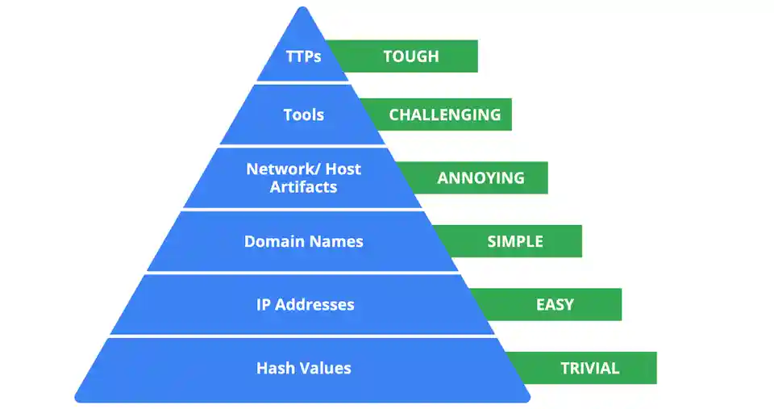

# Indicadores de compromiso
#ciberseguridad #curso-6 #modulo-3 

---
En esta lectura, se le introducirá en el concepto de la Pirámide del Dolor y explorará ejemplos de los diferentes tipos de indicadores de compromiso. Comprender y aplicar este concepto ayuda a las organizaciones a mejorar su defensa y reduce el daño que puede causar un incidente.
## Indicadores de compromiso

Los **Indicadores de compromiso** (**IoC**) ==son pruebas observables que sugieren indicios de un posible incidente de Seguridad==. Los IoC grafican piezas específicas de evidencia que están asociadas con un ataque, como un nombre de archivo asociado con un tipo de software malicioso. ==Puede pensar en un IoC como una prueba que apunta a algo que ya ha sucedido==, como darse cuenta de que han robado algo valioso del interior de un coche.

Los **Indicadores de ataque** (**IoA**) son la ==serie de sucesos observados que indican un incidente en tiempo real==. Los IoA se centran en identificar las pruebas de comportamiento de un atacante, incluidos sus métodos e intenciones.

Esencialmente, los IoC ayudan a identificar el _quién_ y el _qué_ de un ataque después de que haya tenido lugar, mientras que los IoA se centran en encontrar el _por qué_ y el _cómo_ de un ataque en curso o desconocido. Por ejemplo, observar un proceso que realiza una conexión de red es un ejemplo de IoA. El nombre de archivo del proceso y la dirección IP con la que contactó el proceso son ejemplos de IoC relacionados.

**Nota**: Los Indicadores de compromiso no siempre son una confirmación de que se ha producido un Incidente de Seguridad. Los IoC pueden ser el resultado de un error humano, un mal funcionamiento del sistema y otras razones no relacionadas con la Seguridad.
## Pirámide del dolor

No todos los Indicadores de compromiso son iguales en cuanto al valor que aportan a los equipos de Seguridad. Es importante que los profesionales de la Seguridad comprendan los distintos tipos de Indicadores de compromiso para que puedan detectarlos y responder a ellos con rapidez y eficacia. Esta es la razón por la que el investigador de Seguridad David J. Bianco creó el concepto de la [Pirámide](http://detect-respond.blogspot.com/2013/03/the-pyramid-of-pain.html) del Dolor, con el objetivo de mejorar la forma en que se utilizan los Indicadores de compromiso en la Detección de Incidentes.

La Pirámide del Dolor ==capta la relación entre los indicadores de compromiso y el nivel de dificultad que experimentan los actores maliciosos cuando los indicadores de compromiso son bloqueados por los Equipos de Seguridad==. Enumera los distintos tipos de indicadores de compromiso que los profesionales de la Seguridad utilizan para identificar actividades maliciosas.

Cada tipo de indicador de compromiso se separa en niveles de dificultad. Estos niveles representan los niveles de "dolor" a los que se enfrenta un atacante cuando los equipos de Seguridad bloquean la actividad asociada al indicador de compromiso. Por ejemplo, el bloqueo de una dirección IP asociada a un actor malicioso se etiqueta como fácil porque los actores maliciosos pueden utilizar fácilmente diferentes direcciones IP para sortear esto y continuar con sus esfuerzos maliciosos. Si los Equipos de Seguridad son capaces de bloquear los IoC situados en la parte superior de la pirámide, más difícil les resultará a los atacantes continuar con sus ataques. He aquí un desglose de los diferentes tipos de Indicadores de compromiso que se encuentran en la Pirámide del Dolor.

1. **Valores hash**: Hashes que corresponden a archivos maliciosos conocidos. Suelen utilizarse para proporcionar referencias únicas a muestras específicas de software malicioso o a archivos implicados en una intrusión.

2. **Direcciones IP**: Una Dirección de Protocolo de Internet como 192.168.1.1

3. **Nombres de dominio**: Una dirección web como www.google.com

4. **Artefactos de red**: Pruebas observables creadas por actores maliciosos en una red. Por ejemplo, información encontrada en protocolos de redes como las cadenas User-Agent.

5. **Artefactos de host:** Pruebas observables creadas por actores maliciosos en un host. Un host es cualquier dispositivo que esté conectado en una red. Por ejemplo, el nombre de un archivo creado por software malicioso.

6. **Herramientas**: Software que utiliza un actor malicioso para lograr su objetivo. Por ejemplo, los atacantes pueden utilizar herramientas de descifrado de contraseñas como John the Ripper para realizar ataques de contraseña con el fin de obtener acceso a una cuenta.

7. **Tácticas, Técnicas y Procedimientos (TTP)**: Se trata del comportamiento de un actor malicioso. Las Tácticas se refieren a la descripción general de alto nivel del comportamiento. Las técnicas proporcionan descripciones detalladas del comportamiento relacionado con la táctica. Los Procedimientos son descripciones muy detalladas de la técnica. Las TTP son las más difíciles de detectar.