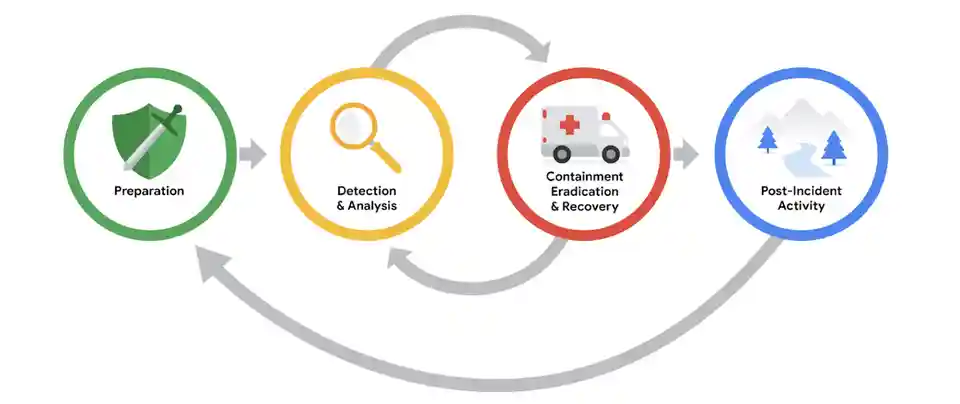

# Revisión posterior al incidente
#ciberseguridad #curso-6 #modulo-3 

---
Anteriormente, usted exploró la fase de contención, Erradicación y Recuperación del Ciclo de vida de respuesta ante incidentes del NIST. Esta lectura explora las actividades implicadas en la fase final del ciclo de vida: **Actividad posterior al incidente** . 
## Actividad posterior al incidente

La fase de actividad posterior al incidente del Ciclo de vida de respuesta a incidentes del NIST es el proceso de revisión de un incidente para identificar áreas de mejora durante la gestión del mismo.

## Lecciones aprendidas

Después de que una organización haya contenido, erradicado y recuperado con éxito un incidente, éste llega a su fin. Sin embargo, esto no significa que el trabajo de los profesionales de la Seguridad esté completo. Los incidentes brindan a las organizaciones y a sus equipos de Seguridad la oportunidad de aprender de lo sucedido y priorizar formas de mejorar el proceso de gestión de incidentes.

Esto suele hacerse mediante una **reunión sobre lecciones aprendidas** , también conocida como **post mortem**. ==Una reunión sobre lecciones aprendidas incluye a todas las partes implicadas después de un incidente grave==. Dependiendo del incidente de un incidente, se pueden programar múltiples reuniones para reunir datos suficientes. El propósito de esta reunión es evaluar el Incidente en su totalidad, valorar las acciones de respuesta e identificar cualquier área de mejora. Proporciona una oportunidad para que la organización y su gente aprendan y mejoren, no para asignar culpas. Esta reunión debe programarse a más tardar dos semanas después de que un incidente haya sido remediado con éxito.

No todos los incidentes requieren su propia reunión sobre lecciones aprendidas; el tamaño y la gravedad de un incidente dictarán si la reunión es necesaria. Sin embargo, los incidentes importantes, como los ataques de ransomware, deben revisarse en una reunión sobre lecciones aprendidas específicas. Esta reunión está formada por todas las partes que puedan participar en cualquier aspecto del proceso de respuesta al incidente. He aquí algunos ejemplos de preguntas que se abordan en esta reunión:

- ¿Qué pasó?

- ¿A qué hora ocurrió?

- ¿Quién lo descubrió?

- ¿Cómo se contenía?

- ¿Qué medidas se tomaron para la recuperación?

- ¿Qué se podría haber hecho de otra manera?

Además de tener la oportunidad de aprender del Incidente, realizar una Reunión sobre lecciones aprendidas tiene otros beneficios. Para las grandes organizaciones, las reuniones sobre lecciones aprendidas ofrecen una plataforma para que los miembros del equipo de todos los departamentos compartan información y recomendaciones para la prevención en el futuro.

**Consejo profesional** : Antes de que un Equipo organice una Reunión sobre lecciones aprendidas, los organizadores deben asegurarse de que todos los asistentes vengan preparados. Los anfitriones suelen elaborar e distribuir de antemano un orden del día de la reunión, que contiene los temas de debate y garantiza que los asistentes estén informados y preparados. Además, deben asignarse de antemano las funciones de la reunión, incluido un moderador que dirija y facilite el debate y un escriba que tome notas de la reunión.
### Recomendaciones

Las reuniones sobre lecciones aprendidas ofrecen oportunidades de crecimiento y mejora. Por ejemplo, los Equipos de Seguridad pueden identificar errores en las acciones de respuesta, lagunas en los procesos y procedimientos o controles de Seguridad ineficaces. Una Reunión sobre lecciones aprendidas debe dar como resultado una lista de acciones prioritarias o recomendaciones procesables destinadas a mejorar los procesos de gestión de incidentes de una organización y la postura general de seguridad. Esto garantiza que las organizaciones están implementando las Lecciones aprendidas después de un Incidente para que no sean vulnerables a experimentar el mismo incidente en el futuro. Algunos ejemplos de cambios que pueden implementarse son la actualización y mejora de las instrucciones del Manual de estrategias o la implementación de nuevas herramientas y tecnologías de seguridad.
## Informe final

A lo largo de este curso, usted ha explorado la importancia que tiene la documentación para registrar los detalles durante el ciclo de vida de la respuesta ante incidentes. Como mínimo, la documentación de respuesta ante incidentes debe describir el incidente cubriendo las 5 W de la investigación de incidentes: _quién_ , _qué_ , _dónde_ , _por qué_ y _cuándo._ Los detalles que se capturan durante la respuesta ante incidentes son importantes para desarrollar documentos adicionales durante el final del ciclo de vida.

Una de las formas más esenciales de documentación que se crea durante el final de un incidente es el **Informe final** . El Informe final proporciona una revisión exhaustiva de un incidente. Los informes finales no están estandarizados y sus formatos pueden variar de una organización a otra. Además, pueden crearse varios informes finales en función del público para el que se redacta. He aquí algunos ejemplos de elementos comunes que se encuentran en un informe final:

- **Resumen ejecutivo** : Un resumen de alto nivel del informe que incluye las conclusiones clave y los hechos esenciales relacionados con el incidente

- **Cronología** : Una cronología detallada del incidente que incluye marcas de tiempo que fechen la secuencia de acontecimientos que condujeron al incidente.

- **Investigación** : Una recopilación de las acciones tomadas a cabo durante la Detección y el Análisis del Incidente. Por ejemplo, el análisis de un artefacto de red como una captura de paquetes revela información sobre las actividades que tienen lugar en una red.

- **Recomendaciones** : Una lista de acciones sugeridas para la prevención futura

**Consejo profesional** : Cuando redacte el Informe final, tenga en cuenta el público al que va dirigido. A menudo, los ejecutivos de empresas y otros profesionales que no se dedican a la seguridad y que no tienen los conocimientos necesarios para comprender los detalles técnicos leerán los informes finales posteriores a los incidentes. Tener en cuenta el público al redactar un informe final que le ayudará a comunicar eficazmente los detalles más importantes.