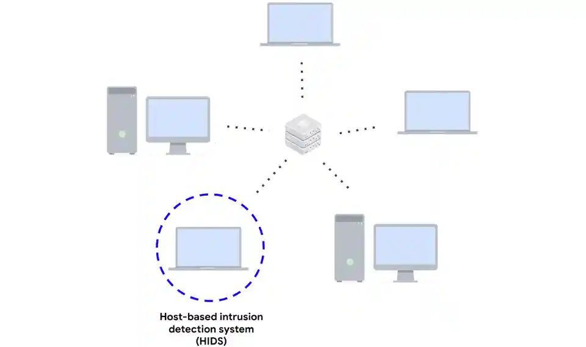
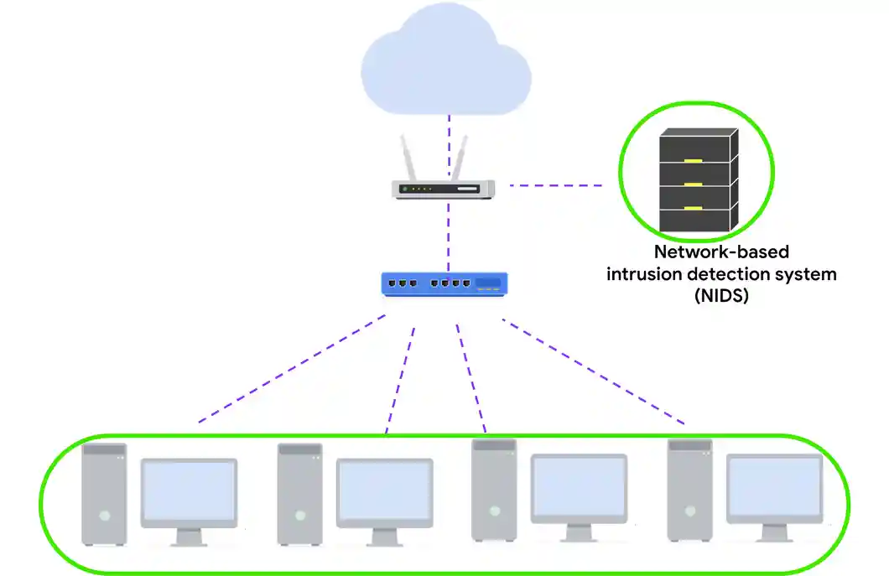

# Herramientas y técnicas de detección
#ciberseguridad #curso-6 #modulo-4 

---
En esta lectura, examinará los diferentes tipos de tecnologías de sistemas de detección de intrusiones (IDS) y las alertas que producen. También explorará las dos técnicas de detección más comunes utilizadas por los sistemas de detección. Comprender las capacidades y limitaciones de las tecnologías IDS y sus técnicas de detección le ayudarán a interpretar la información de seguridad para identificar, analizar y responder a los eventos de seguridad.

Como ha aprendido, un **Sistema de detección de intrusiones (IDS** ) es una aplicación que monitoriza la actividad del sistema y alerta sobre posibles intrusiones. Las tecnologías IDS ayudan a las organizaciones a supervisar la actividad que se produce en sus sistemas y redes para identificar indicios de actividad maliciosa. Dependiendo del lugar que elija para instalar un IDS, éste puede estar basado en el host o en la red.
## Sistema de detección de intrusiones basado en el anfitrión

Un **sistema de detección de intrusiones basado en el anfitrión (HIDS** ) es una aplicación que monitoriza la actividad del anfitrión en el que está instalado. Un HIDS se instala como un agente en un host. Un host también se conoce como **punto final** , que es cualquier dispositivo conectado a una red como una computadora o un servidor.

Normalmente, los agentes HIDS se instalan en todos los puntos finales y se utilizan para Monitorear y Detectar Amenazas a la Seguridad. Un HIDS monitoriza la actividad interna que tiene lugar en el host para identificar cualquier comportamiento no autorizado o anómalo. Si se detecta algo inusual, como la instalación de una aplicación no autorizada, el HIDS lo registra y envía una alerta.

Además de monitorear los flujos de tráfico entrante y saliente, HIDS puede tener capacidades adicionales, como monitorear los sistemas de archivos, el uso de recursos del sistema, la actividad de los usuarios, etc.

Este diagrama muestra una herramienta HIDS instalada en una computadora. El círculo de puntos alrededor del host indica que sólo está monitorizando la actividad local en la única computadora en la que está instalada.

## Sistema de detección de intrusiones basado en la red

Un **Sistema de detección de intrusiones basado en la red** ( **NIDS** ) es una aplicación que recoge y monitoriza el Tráfico de red y los Datos de red. El software NIDS se instala en dispositivos situados en partes específicas de la red que se desea supervisar. La aplicación NIDS inspecciona el tráfico de red procedente de distintos dispositivos de la red. Si se detecta algún tráfico de red malicioso, el NIDS lo registra y genera una alerta.

Este diagrama muestra un NIDS instalado en una red. El círculo resaltado alrededor del servidor y las computadoras indica que el NIDS está instalado en el servidor y está monitorizando la actividad de las computadoras.

El uso de una combinación de HIDS y NIDS para monitorear un entorno puede proporcionar un enfoque multicapa para la detección de intrusiones y la respuesta a las mismas. Las herramientas HIDS y NIDS proporcionan una perspectiva diferente de la actividad que se produce en una red y en los hosts individuales que están conectados a ella. Esto ayuda a proporcionar una visión completa de la actividad que se produce en un entorno.
## Técnicas de detección

Los sistemas de Detección pueden utilizar diferentes técnicas para detectar amenazas y ataques. Los dos tipos de técnicas de detección que suelen utilizar las tecnologías IDS son el Análisis basado en firmas y el Análisis basado en anomalías.
## Análisis basado en firmas

El **Análisis de firmas** , o Análisis basado en firmas, es un Método de Detección que se utiliza para encontrar Eventos de Interés. Una **Firma** es un Patrón que se asocia con una actividad maliciosa. Las Firmas pueden contener patrones específicos como una secuencia de números binarios, bytes, o incluso datos específicos como una dirección IP.

Anteriormente, usted exploró la Pirámide del Dolor, que es un concepto que prioriza los diferentes tipos de **Indicadores de compromiso** (IoC) asociados con un ataque o amenaza, como direcciones IP, Herramientas, Tácticas, Técnicas y más. Los IoC y otros indicadores de ataque pueden ser útiles para crear firmas específicas para detectar y bloquear ataques.

Se pueden utilizar distintos tipos de firmas en función del tipo de amenaza o ataque que se desee detectar. Por ejemplo, una firma antimalware contiene patrones asociados al software malicioso. Esto puede incluir secuencias de comandos maliciosos que utilizan el software malicioso. Las Herramientas IDS monitorizarán un entorno en busca de eventos que coinciden con los patrones definidos en esta Firma de software malicioso. Si un evento coincide con la firma, el evento se registra y se genera una alerta.
### Ventajas

- **Baja tasa de falsos positivos:** El análisis basado en firmas es muy eficaz a la hora de detectar amenazas conocidas, ya que se limita a comparar la actividad con las firmas. Esto conduce a un menor número de falsos positivos. Recuerde que un falso **positivo** es una alerta que detecta incorrectamente la presencia de una amenaza.
### Desventajas

- **Las Firmas pueden ser evadidas:** Las firmas son únicas y los atacantes pueden modificar sus comportamientos de ataque para eludirlas. Por ejemplo, los atacantes pueden realizar ligeras modificaciones en el código del software malicioso para alterar su firma y evitar la detección.

- **Las firmas requieren actualizaciones:** El Análisis basado en firmas se basa en una Base de datos de firmas para Detectar amenazas. Cada vez que se descubre un nuevo exploit o ataque, deben crearse nuevas firmas y añadirse a la base de datos de firmas.

- **Incapacidad para detectar amenazas desconocidas:** El análisis basado en firmas se basa en la detección de amenazas conocidas mediante firmas. No se pueden detectar las amenazas desconocidas, como las nuevas familias de software malicioso o los ataques de **Día cero** , que son exploits hasta ahora desconocidos.
## Análisis basado en anomalías

El **Análisis basado en anomalías** es un Método de Detección que identifica comportamientos anómalos. El Análisis basado en anomalías consta de dos fases: una fase de Entrenamiento y una fase de Detección. En la fase de Entrenamiento, debe establecerse una línea de base del comportamiento normal o esperado. Las líneas de base se desarrollan recopilando datos que corresponden al comportamiento normal del sistema. En la fase de Detección, la actividad actual del sistema se compara con esta línea de base. La actividad que se produce fuera de la línea de base se registra y se genera una alerta.
### Ventajas

- **Capacidad para detectar amenazas nuevas y en evolución:** Una diferencia del análisis basado en firmas, que utiliza patrones conocidos para detectar amenazas, el análisis basado en anomalías _puede_ detectar amenazas desconocidas.
### Desventajas

- **Alto índice de falsos positivos:** Cualquier comportamiento que se desvíe de la línea de base puede ser marcado como anómalo, incluidos los comportamientos no maliciosos. Esto conduce a una alta tasa de falsos positivos.

- **Compromiso pre** existente: La existencia de un atacante durante la fase de Entrenamiento incluyendo comportamientos maliciosos en la línea de base. Esto puede llevar a pasar por alto a un atacante preexistente.
## Puntos clave

Las tecnologías IDS son una herramienta de Seguridad esencial que encontrarás en tu viaje por la Seguridad. Para recapitular, un NIDS supervisa toda una red, mientras que un HIDS supervisa los puntos finales individuales. Las tecnologías IDS generan diferentes tipos de alertas. Por último, las tecnologías IDS utilizan diferentes técnicas de detección como el análisis basado en firmas o en anomalías para identificar actividades maliciosas.