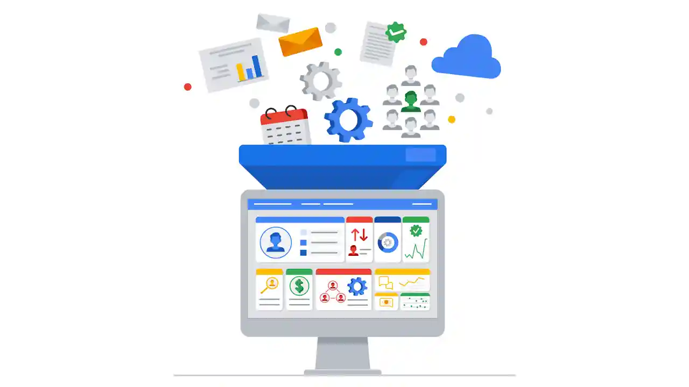

# Fuentes de registro e ingestión de registros
#ciberseguridad #curso-6 #modulo-4

---
En esta lectura, profundizará en la importancia de la gestión de registros. Quizás recuerde que las herramientas de **administración de información y eventos de seguridad** **(SIEM** ) recopilan y analizan los datos de registro para supervisar las actividades críticas de una organización. También ha aprendido sobre el **análisis** de registros, que es el proceso de examinar los registros para identificar los eventos de interés. Entender cómo se introducen las fuentes de registro en las herramientas SIEM es importante porque ayuda a los analistas de seguridad a comprender los tipos de datos que se están recopilando y puede ayudar a los analistas a identificar y priorizar los incidentes de seguridad.
## Visión general del proceso SIEM

Anteriormente, usted cubría el proceso SIEM. A modo de repaso, el proceso consta de tres pasos:

1. **Recopilar y agregar Datos** : Las herramientas SIEM recopilan Datos de Evento de varias fuentes de datos.

2. **Normalizar datos**: Los Datos de Evento que se han recopilado se normalizan. La normalización convierte los datos a un formato estándar para que se estructuren de forma coherente y sean más fáciles de leer y buscar. Aunque la normalización de datos es una característica común en muchas herramientas SIEM, es importante tener en cuenta que las herramientas SIEM varían en sus capacidades de normalización de datos.

3. **Analizar los Datos**: Una vez recopilados y normalizados los Datos, las herramientas SIEM los analizan y correlacionan para identificar patrones comunes que indican una actividad inusual.    

Esta lectura se centra en el primer paso de este proceso, la recopilación y agregación de Datos.
## Ingesta de registros

Los datos son necesarios para que las herramientas SIEM funcionen con eficacia. Las herramientas SIEM deben recopilar primero los Datos mediante la ingestión de registros. La ingestión de registros es el proceso de recopilación e importación de datos de fuentes de registro a una herramienta SIEM. Los Datos proceden de cualquier fuente que genere datos de registro, como un servidor.

En la ingestión de registros, el SIEM crea una copia de los Datos de Evento que recibe y los conserva en su propio almacenamiento. Esta copia permite al SIEM analizar y procesar los Datos sin modificar directamente los registros de la fuente original. La recopilación de datos de eventos proporciona una plataforma centralizada para que los analistas de seguridad analicen los datos y respondan a los incidentes. Estos Datos de eventos incluyen intentos de autenticación, actividad de la red y mucho más.
### Transmisores de registros

Hay muchas formas en que las herramientas SIEM pueden ingresar datos de registro. Por ejemplo, puede cargar datos manualmente o utilizar software que le ayude a recopilar datos para la gestión de registros. Cargar datos manualmente puede resultar ineficaz y llevar mucho tiempo, ya que las redes pueden contener millas de sistemas y dispositivos. Por lo tanto, es más fácil utilizar software que ayude a recopilar datos.

Una forma habitual en que las organizaciones recopilan los datos de registro es utilizar reenviadores de registro. Los reenviadores de registros son software que automatizan el proceso de recopilación y envío de datos de registro. Algunos sistemas operativos tienen reenviadores de registro nativos. Si utiliza un sistema operativo que no dispone de un reenviador de registros nativos, podría instalar un software de reenvío de registros de terceros en un dispositivo. Después de instalarlo, configuraría el software para especificar qué registros reenviar y dónde enviarlos. Por ejemplo, puede configurar los registros para que se envíen a una herramienta SIEM. A continuación, la herramienta SIEM procesaría y normalizaría los datos. Esto permite que los Datos sean fácilmente buscados, explorados, correlacionados y analizados.

**Nota** : Muchas herramientas SIEM utilizan sus propios reenviadores de registros propietarios. Las herramientas SIEM también pueden integrarse con reenviadores de registros de código abierto. La elección del reenviador de registros adecuado depende de muchos factores, como los requisitos específicos de su sistema u organización, la compatibilidad con su infraestructura existente, etc.
## Puntos clave

Las herramientas SIEM requieren datos para ser eficaces. Como analista de seguridad, utilizará las herramientas SIEM para acceder a los eventos y analizar los registros cuando esté investigando un incidente. En su carrera de seguridad, puede que incluso se le encargue configurar un SIEM para recopilar datos de registro. Es importante que entienda cómo se ingieren los datos en las herramientas SIEM porque esto le permitirá comprender de dónde proceden las fuentes de registro, lo que puede ayudar a identificar el origen de un incidente de Seguridad.
## Recursos

Aquí tiene algunos Recursos si desea aprender más sobre el proceso de ingestión de registros para Splunk y Chronicle:

- [Guía sobre la ingestión de datos en Splunk](https://docs.splunk.com/Documentation/SplunkCloud/9.0.2303/Data/Howdoyouwanttoadddata)

- [Guía sobre la ingestión de datos en Chronicle](https://cloud.google.com/chronicle/docs/data-ingestion-flow)