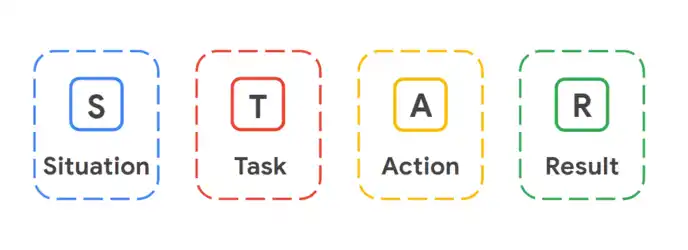

Ha estado aprendiendo diferentes técnicas y estrategias que podrá utilizar en futuras entrevistas para puestos de trabajo en el ámbito de la ciberseguridad. En esta lectura, conocerá más detalles sobre el Método STAR para responder a las preguntas de una entrevista. Implementar esta estrategia le ayudará a responder a las preguntas de la entrevista con confianza y claridad.

## El Método STAR

Cuando se entrevista para un puesto de trabajo, puede resultar difícil transmitir a sus entrevistadores los detalles adecuados sobre su historial profesional y sus aptitudes. Utilizar el Método STAR puede ayudarle a compartir sus historias de éxito de forma eficaz y estratégica. STAR significa Situación, Tarea, Acción y Resultado. El uso de este Método le permite describir los posibles retos a los que se enfrentó en funciones anteriores y le da la oportunidad de mostrar cómo abordó de forma reflexiva la resolución de esos problemas desde el principio hasta el final.

### **Situación**

La **situación** es el proyecto en el que trabajó o un reto que tuvo que superar. Por ejemplo, quizá tuvo que gestionar los comentarios negativos de un cliente descontento con su empresa, un error de sistema en su dispositivo de trabajo que ralentizó una transacción de un cliente, o quedarse solo en la oficina durante un largo periodo de tiempo. La descripción completa de la situación permite al entrevistador hacerse una idea clara del reto que tuvo que superar.

### **Tarea**

La **tarea** describe las responsabilidades clave o la función que desempeñó para resolver el reto descrito en la fase de situación del Método STAR. Especificar cuál es la tarea aporta claridad sobre cuáles eran sus objetivos en esta situación.

### **Acción**

La **acción** describe los pasos exactos que dio para resolver la situación desafiante que describió al principio del Método STAR. La acción es crucial para el Método STAR porque permite al empresario comprender qué opciones tomó usted para lograr el resultado deseado durante un conflicto o reto real. Los empresarios quieren empleados que puedan pensar con rapidez y tomar decisiones que ayuden a resolver los problemas.

### **Resultado**

Por último, compartir el **resultado** de su reto o ejemplo muestra a los empleadores cómo se resolvió la situación como resultado directo de las acciones que usted llevó a cabo. Cuando participe en una entrevista, debe asegurarse de que cualquier ejemplo que dé con el Método STAR termine en un resultado positivo. Los resultados positivos muestran al empleador que usted es una persona que ha demostrado su capacidad para resolver con éxito las situaciones y pueden hacer que el empleador le ofrezca un puesto de trabajo. Por supuesto, no todas las situaciones tienen resultados completamente positivos; si un empleador le pregunta sobre una situación que no tuvo un resultado positivo, intente centrarse en lo que aprendió de la situación y en cómo esa experiencia le ayudó a convertirse en un mejor empleado.