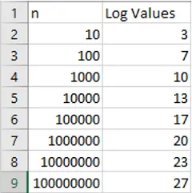

## **Introducción**
---
En esta lectura, explorará un ejemplo trabajado de un fragmento de código escrito en Python, junto con la forma en que lo evaluaría utilizando la notación Big-O.

Evaluar el rendimiento de una aplicación garantiza que el código escrito es bueno y adecuado para su propósito. La cuestión es cómo evaluamos la eficacia Cuando medimos la electricidad, utilizamos kilovatios-hora, es decir, cuántos kilovatios consumirá un electrodoméstico si funciona durante una hora. El electrodoméstico no siempre funcionará durante una hora, y puede tener diferentes necesidades en función de la configuración utilizada, es más bien una regla general para evaluar el coste.

Cuando se evalúan soluciones de codificación, se utiliza la notación Big-O. Así pues, la notación Big-O es el kilovatio hora de la evaluación del código. Se puede aplicar para medir cuánto tiempo tardará un fragmento de código o cuánto espacio utilizará en la memoria. No todos los procesadores funcionarán a la misma velocidad, por lo que en lugar de cronometrar una aplicación, se cuenta el número de instrucciones que inicia una aplicación.

## 1 ¿Qué medida refleja la ejecución más rápida posible de un código?

Exploremos qué medida refleja la ejecución más rápida posible de algún código.

### 1.1 `O(1)`

Usted utiliza un algoritmo de tiempo constante que tarda `O(1)` (O-de-uno) en computar. Esto determina que sólo se necesitará un **cómputo** para completar una tarea. Un ejemplo de esto es imprimir un elemento de una matriz.

```python
# An array with 5 numbers 
array = [0,1,2,3,4]

# retrieve the number found at index location 3 
print(array[3])
```

En este caso, no importa cuántos valores existan en la matriz, la aproximación tiene un Big-O de uno. Esto significa que ejecutar este código se considera `O(1)`.

### 1.2 `O(n)`

A continuación, exploremos un ejemplo de `O(n)`. Tomando la misma matriz, se escribe una sentencia `if` que busca el número `5`. Para establecer que el `5` no está ahí, tiene que comprobar cada elemento de la matriz.

```python
# An array with 5 numbers 
array = [0,1,2,3,4] 

  

if 5 in array:
    print("five is alive")
```

En el ejemplo anterior, no hay ningún `5`, por lo que no hay ninguna impresión. Para establecer esto, se hicieron cinco comprobaciones en esta matriz. Como la entrada `n = 5`, se dice que este código tiene un Big - O de `O(n)`. Para entenderlo mejor, ampliemos la matriz a `10`, dejando fuera el `5`.

```python
# an array with 10 numbers 
array = [0,1,2,3,4,6,7,8,9,10]

  

if 5 in array:
    print("five is still alive")
```

Al extender la matriz 10 enteros, el número de cómputos se ha convertido ahora en `10`. Esto se sigue llamando `O(n)` porque el tamaño de la entrada es `10`, que es el número de comprobaciones que hay que hacer antes de que el programa termine.

### 1.3 `O(log n)`

Esta búsqueda es menos intensiva que `O(n)` pero da más trabajo que `O(1)`. `O(log n)` ==es una búsqueda logarítmica y aumentará a medida que se añadan nuevas entradas==, pero estas entradas sólo ofrecen aumentos marginales. Un ejemplo excelente de esto en acción es una búsqueda binaria. La búsqueda binaria se trata con más detalle más adelante en el curso.

Ahora, imagine que juega a un juego de adivinanzas con las siguientes indicaciones: demasiado alto, demasiado bajo o correcto. Se le da un rango de 100 a 1. Puede decidir abordar el problema sistemáticamente. Primero, adivina 50 - demasiado alto. Entonces, adivina 25 - que es demasiado alto. Puede optar entonces por 12 ó 13. Lo que ocurre aquí es que está reduciendo a la mitad el espacio de búsqueda con cada conjetura.

Así, mientras que la entrada a esta función era 100 utilizando un enfoque de búsqueda binaria, usted debería dar con la respuesta en menos de 5 o 6 conjeturas. Esta solución tendría una complejidad temporal de `O(log n)`. Incluso si `n` (el rango de números introducidos) es diez veces mayor. No necesitará diez veces más conjeturas.

He aquí un desglose de esos pasos en la matriz.

```python
array = [0,1,2,3,4,6,7,8,9,10]

print("##Step One")
print("Array")
print(array)

midpoint = int(len(array)/2)
print("the midpoint at step one is: " , array[midpoint])

print()

print("##Step Two")
array = array[:midpoint] # 6 is the midpoint of the array 
print("Array")
print(array)

# running this shows the numbers left to check 
# is 5 < 3 
# no 
# so discard the left hand side 
# so the array is halved again 

midpoint=int(len(array)/2)
print("the midpoint is: ",  array[midpoint])
print()

print("##Step Three") 
array = array[midpoint:] # so the array is halved at the midpoint
print(array)

# check for the midpoint 
midpoint=int(len(array)/2)
print("the midpoint is: " , array[midpoint])

# is 4 < 5 
# yes look to the right

print()

print("##Step Four") 
print(array[midpoint:]) 

# check for the midpoint 
array = array[midpoint:] # so the array is halved at the midpoint
midpoint=int(len(array)/2)

print()

print("##Step Five") 
array = array[midpoint:] 
print(array)
print("only one value to check and it is not 5")
```

Observará que para determinar si `5` está presente, se necesitaron `5` pasos. Eso es una puntuación big-O de `O(5)`. Puede ver que es mayor que `O(1)` pero menor que `O(n)`. Ahora, ¿qué ocurre cuando la matriz se amplía a 100? Al buscar un número en una matriz de `10`, tardó 5 intentos. Buscar en una matriz de 100 no llevará 50 conjeturas; no llevará más de 10. Igualmente, si la lista se amplía a 1000, las conjeturas sólo subirán a 15-20.

De esto se deduce que no es `O(1)` porque la respuesta no es inmediata. No es big-`O(n)` porque el número de conjeturas no sube con el tamaño `n` de la matriz. Así que aquí se dice que la complejidad es `O(log(n))`.

Para comprender mejor cómo los valores logarítmicos son sólo un aumento gradual, observe una tabla logarítmica hasta 100.000.000. Este objetivo muestra que `O(log n)` sólo incurre en un coste de procesamiento mínimo. Ejecutar una búsqueda binaria en una matriz con cualquier valor de `n` hará siempre, en el peor de los casos, el número de cálculos que se encuentra en la columna de valores de registro.

`

`O(n^2)` es pesado en computación. Se trata de una complejidad cuadrática, lo que significa que el trabajo se duplica por cada elemento de la matriz. Una forma excelente de visualizar esto es considerar que tiene varias matrices. Siguiendo con el ejemplo anterior, exploremos el siguiente código:

```python
new_array=[] # an array to hold all of the results 

# array with five numbers 
array = [0,1,2,3,4]

for i in range(len(array)): # the array has five values, so this is n=5 
    for j in range(len(array)): # still the same array so n = 5 
        new_array.append(i*j) # every computation made is stored here 
        
print(len(new_array)) #how big is this new array ?
```

El primer bucle igualará el número de elementos introducidos, `n`. El segundo bucle también mirará el número de elementos de entrada, `n`. Por lo tanto, puede decirse que la complejidad global de ejecutar este planteamiento es `n*n` que es `n^2` (n-cuadrado). Para saber cuántos cálculos se han realizado, hay que imprimir el número de veces que se ha utilizado `n` en el bucle, como se indica a continuación.

```python
n = 5 #size of array 
print(n*n) # how big is this new array ?
```
Si sabe que la matriz tiene 25 elementos, entonces entiende los principios de cálculo de la notación Big-O. Para comprobar aún más sus conocimientos, ¿cuántos cálculos serían necesarios si `n = 6`? ¿Es decir, si la matriz tuviera 6 valores? La respuesta es 6 x 6, es decir, 36.

## **2 Representación visual del problema**
---
A continuación se muestra una representación gráfica de cómo se relaciona `n` con el número de cómputos necesarios.

![[grafica-complejidad-temporal.webp]]

Como puede ver, el mejor tiempo al que se puede aspirar es `O(1)`; `O(log n)` sigue siendo excelente. `O(n)` está bien y `O(n^2)` no es genial.

## **3 Peor caso, mejor caso y caso medio**
---
Por supuesto, no siempre es posible saber cuánto tardará un planteamiento. Al observar el ejemplo del bucle inicial, se realizó una búsqueda de un elemento que estaba ausente. Se puede decir que buscar en un bucle lleva `O(n)` veces, pero no siempre es así.

Considere que el elemento buscado es el primero de la matriz. Entonces el retorno será bastante bueno ¡en tiempo de `O(1)`! En el ejemplo proporcionado hay que buscar cada elemento antes de determinar que no estaba: `O(n)` tiempo. El caso intermedio sería que se encontrara hacia la mitad del bucle `O(n/2)`. Cuando se evalúa un planteamiento, se utilizan tres definiciones: mejor caso, peor caso y caso medio.

## **Conclusión**
---
Esta lectura ha introducido la noción de tiempo en relación con la complejidad y usted ha explorado un ejemplo trabajado de un fragmento de código escrito en Python. También ha investigado cómo lo evaluaría utilizando la notación Big-O.

Una buena pregunta que debe hacerse antes de empezar es: "¿cuántos cálculos emplea mi solución y hay alguna forma mejor de hacerlo?" Ahora que sabe cómo utilizar una métrica para evaluar la solución a un problema dado, puede empezar a pensar en su eficacia en lo que respecta a la complejidad temporal.